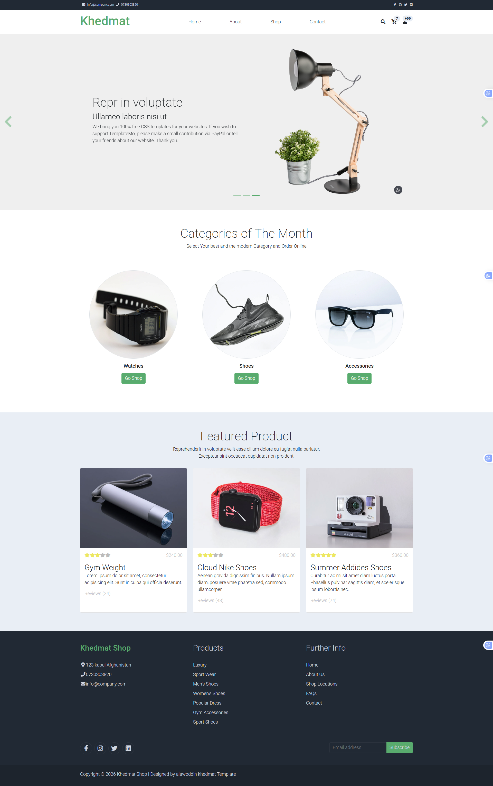

# React Small Website Project

A simple and modern website built with **React.js**. This project was created by following a tutorial and completed as a small fully functional website to improve my frontend development skills.

## 🚀 Live Demo
live link = https://github.com/alawoddin/React-Tutorials-up-project

## 📸 Screenshot




## 🛠️ Technologies Used
- React.js
- JavaScript (ES6+)
- HTML5
- CSS3

## ✨ Features
- Responsive design
- Clean and modern UI
- Reusable React components
- Fast and dynamic user experience
- Beginner-friendly project structure

## 📚 What I Learned
- React Components
- JSX Syntax
- Props
- State Management
- CSS Styling
- Responsive Design
- Project Structure

## 📂 Project Structure
```bash
src/
├── components/
├── assets/
├── App.js
└── index.js

## Project Install 

git clone https://github.com/alawoddin/React-Tutorials-up-project.git
cd your-repo-name
npm install
npm start
